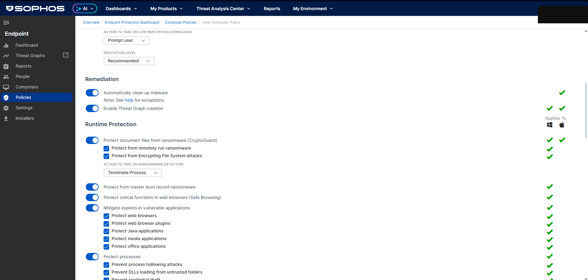
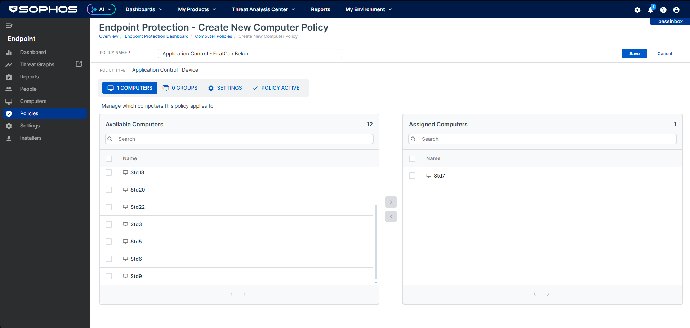
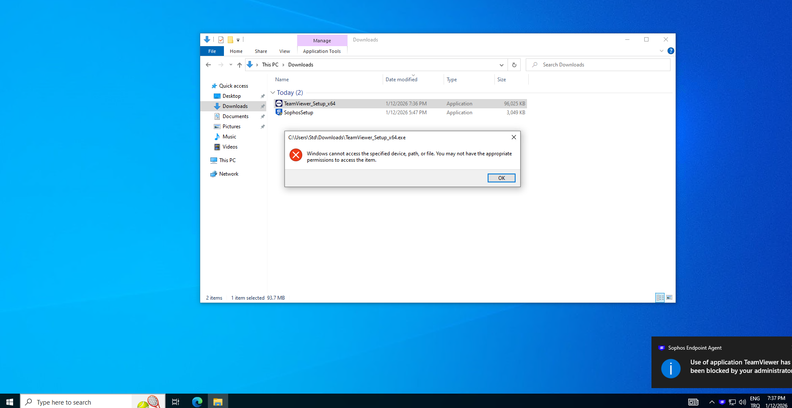
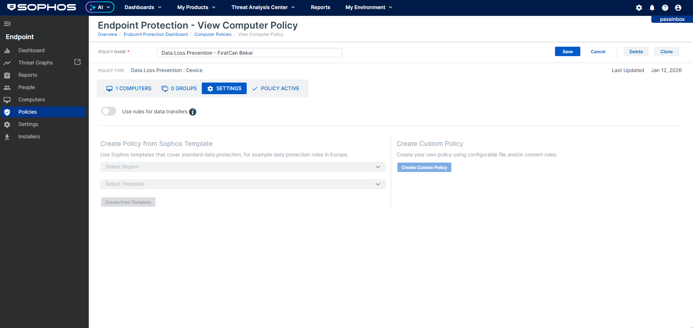
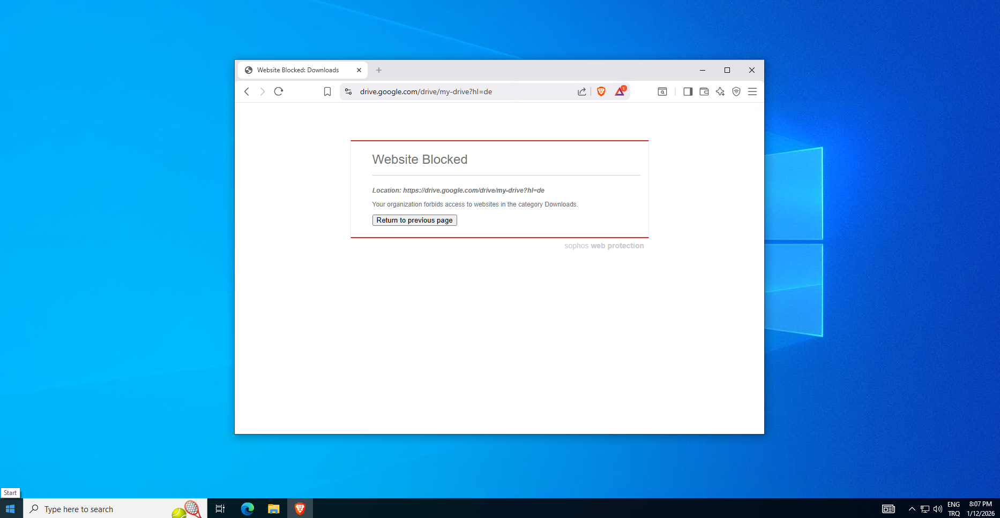
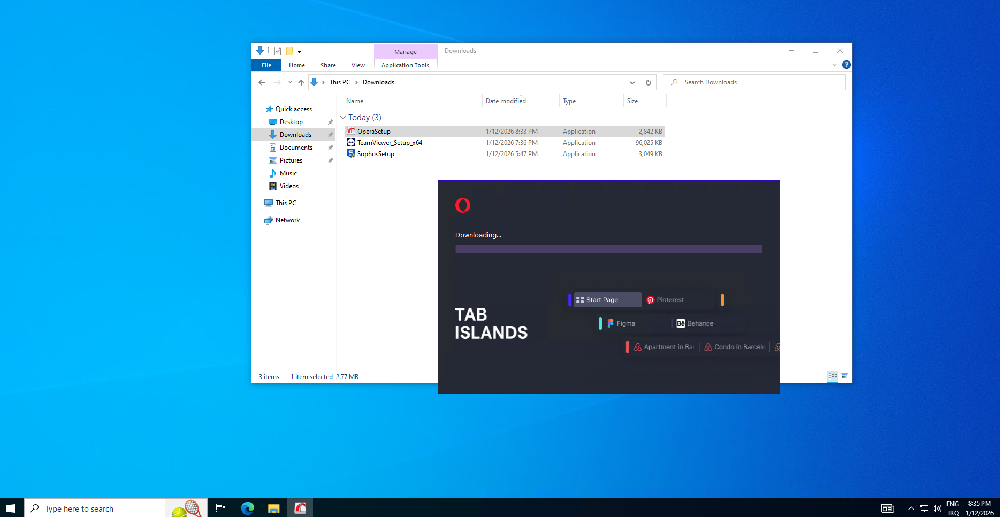
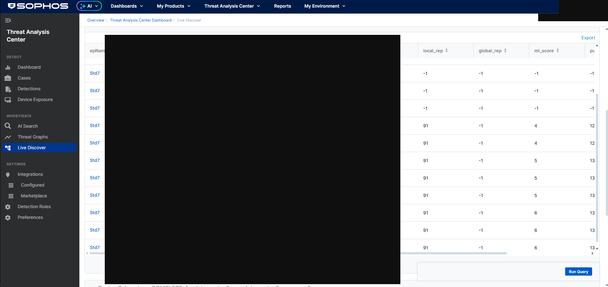
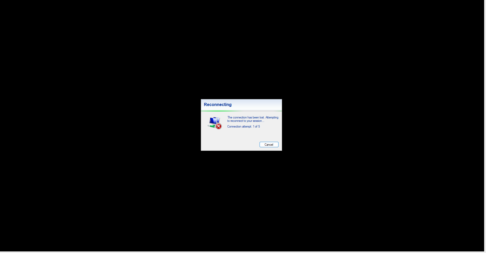
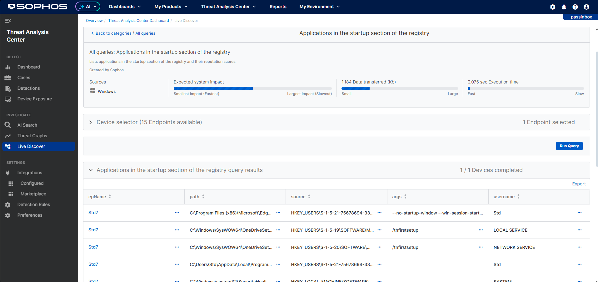
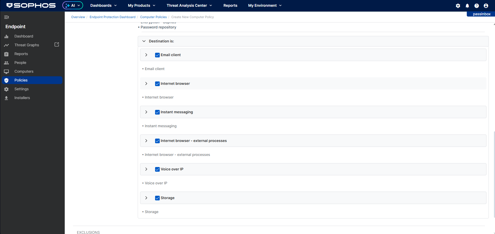

# 🛡️ Hands-On Sophos Intercept X EDR Lab — Policy Design & Threat Validation

[](https://www.sophos.com)
[](https://cloud.sophos.com)
[](https://github.com/firatcanbekar/sophos-edr-lab)
[](https://github.com/firatcanbekar/sophos-edr-lab)
[](https://github.com/firatcanbekar/sophos-edr-lab)

> **A hands-on endpoint security project** built on Sophos Intercept X and the Sophos Central cloud console, simulating real-world endpoint security workflows in a controlled lab environment. Covers the full endpoint security lifecycle: agent deployment, custom threat protection, zero-trust application control, data loss prevention, threat simulation, incident containment, and proactive threat hunting with Live Query (OSQuery).

> 📄 **[View Full Presentation (PDF)](./Zero_Trust_Endpoint_Architecture.pdf)** — slide-by-slide walkthrough of all phases with screenshots and architecture diagrams.

---

## 📋 Table of Contents

- [Project Overview](#-project-overview)
- [Lab Architecture](#-lab-architecture)
- [Technology Stack](#-technology-stack)
- [Tasks Completed](#-tasks-completed)
  - [Task 1 — Agent Deployment](#task-1--agent-deployment)
  - [Task 2 — Threat Protection Policy](#task-2--threat-protection-policy)
  - [Task 3 — Web Control Policy](#task-3--web-control-policy)
  - [Task 4 — Application Control Policy](#task-4--application-control-policy)
  - [Task 5 — Data Loss Prevention (DLP)](#task-5--data-loss-prevention-dlp)
  - [Task 6A — Malware Simulation: EICAR Test](#task-6a--malware-simulation-eicar-test)
  - [Task 6B — Detect vs. Block: Policy Behavior](#task-6b--detect-vs-block-policy-behavior)
  - [Task 7 — Incident Response: Device Isolation](#task-7--incident-response-device-isolation)
  - [Task 8 — Proactive Threat Hunting: Live Discover](#task-8--proactive-threat-hunting-live-discover)
  - [Task 9 — Log Analysis & Reporting](#task-9--log-analysis--reporting)
- [Key Security Principles](#-key-security-principles)
- [Skills Demonstrated](#-skills-demonstrated)
- [Lessons Learned](#-lessons-learned)
- [How to Reproduce This Lab](#-how-to-reproduce-this-lab)

---

## 🧭 Project Overview

|  |  |
|---|---|
| **What I built** | A structured hands-on lab built to understand how enterprise endpoint security platforms operate in practice — covering policy design, zero-trust controls, DLP, threat simulation, incident response, and threat hunting. |
| **Why** | To build practical, verifiable experience with enterprise EDR platforms — learning through doing, not just reading. |
| **How validated** | Every task was verified through Sophos Central logs, agent notifications, endpoint behavior, Live Discover query results, and report dashboards. No task is marked complete without evidence. |
| **Key skills** | Sophos Central policy management, custom policy creation, DLP, Application Control, Live Query (OSQuery), Threat Graph analysis, incident response workflows |
| **Environment** | Sophos Central cloud console (cloud.sophos.com) — managed endpoint: **Std7** (Windows). Policy prefix: **FiratCan Bekar** |

---

## 🏗 Lab Architecture

```text
┌─────────────────────────────────────────────────────────┐
│             Sophos Central (cloud.sophos.com)            │
│                   Management Console                     │
└────────────┬──────────────┬───────────────┬─────────────┘
             │              │               │
    ┌────────▼───────┐  ┌───▼────────┐  ┌──▼──────────────┐
    │ Threat Protect │  │ Web Control│  │  App Control     │
    │ Policy (Device)│  │ (User)     │  │  (Device)        │
    │ • Deep Learning│  │ • Category │  │  • TeamViewer    │
    │ • CryptoGuard  │  │   blocks   │  │  • uTorrent      │
    │ • Runtime Prot │  │ • DLP rules│  │  Block/Monitor   │
    └────────────────┘  └────────────┘  └──────────────────┘
             │
    ┌────────▼───────────────────────────┐
    │         Managed Endpoint           │
    │              Std7                  │
    │  Windows — SophosSetup v1.23       │
    │  Sophos Intercept X Agent          │
    │  Status: Protected ✅              │
    └────────────────────────────────────┘
```

| Component | Details |
|---|---|
| **Management Platform** | Sophos Central — cloud.sophos.com |
| **Managed Endpoint** | Std7 (Windows workstation) |
| **Managed Users** | FiratcanBekar, STD7Std (2 users) |
| **Agent Version** | SophosSetup v1.23 |
| **Policy Scope** | Device-level (Threat Protection, App Control, DLP) + User-level (Web Control) |

---

## 🛠 Technology Stack

| Technology | Version / Details |
|---|---|
| **EDR Platform** | Sophos Intercept X with EDR |
| **Management Console** | Sophos Central — cloud.sophos.com |
| **Endpoint OS** | Windows (Std7 workstation) |
| **Agent** | SophosSetup v1.23 |
| **Threat Simulation** | EICAR AV Test File (eicar.org) |
| **Threat Hunting** | Live Discover (OSQuery) — 465 queries, 22 categories |
| **Browsers tested** | Brave, Opera (cross-browser enforcement) |
| **Test applications** | TeamViewer, uTorrent (blocked), Opera (monitored) |
| **DLP Test File** | `Hassas Bilgiler Test.txt` (PII dummy data) |
| **DLP Templates** | Sophos Germany: PII, bank/card accounts, contact details, confidential docs |

---

## ✅ Tasks Completed

---

### Task 1 — Agent Deployment

**Goal:** Install the Sophos Endpoint agent on a Windows workstation and verify the device is protected and visible in the Sophos Central console.

**Steps:**
- Downloaded `SophosSetup.exe` (v1.23) from cloud.sophos.com
- Installed the agent on **Std7** (Windows endpoint)
- Verified enrollment in Sophos Central under **My Products → Endpoint**

**Verification:**
- Device **Std7** appeared in the Sophos Central device list with status: **Protected ✅**
- Sophos Endpoint Agent running on the endpoint, tray icon active
- Device assigned to the correct policy groups



> 📸 *Screenshots 1–18: SophosSetup installer, installation progress, Sophos Central device list showing Std7 — Protected*

---

### Task 2 — Threat Protection Policy

**Goal:** Create a custom Threat Protection policy with comprehensive settings covering malware defense, ransomware protection, and runtime behavior monitoring.

**Policy Name:** `Threat Protection-FiratCan Bekar` | **Applied to:** Device — Std7

**Configuration:**

| Setting | Value |
|---|---|
| Live Protection | ✅ Enabled |
| Deep Learning (ML) | ✅ Enabled |
| Real-time Scanning (Local + Network Shares) | ✅ Enabled |
| CryptoGuard (Ransomware) | ✅ Terminate process |
| CryptoGuard — Remote Ransomware + EFS | ✅ Enabled |
| MBR Ransomware Protection | ✅ Enabled |
| Safe Browsing | ✅ Enabled |
| AMSI | ✅ Enabled |
| Adaptive Attack Protection | ✅ Enabled |
| IPS / C2 Beacon Block | ✅ Enabled |
| Exploit Mitigations | Browsers, Plugins, Java, Office, Media |
| Process Hollowing / DLL / Credential / Privilege Escalation | ✅ All Enabled |
| Auto-clean malware + Threat Graph | ✅ Enabled |
| Policy Status | **Active** |

**What I learned:** Setting CryptoGuard to **"Terminate process"** instead of just alerting means ransomware is stopped before file encryption begins — not just detected after the fact. Understanding the difference between detection and prevention settings was one of the key practical lessons from this task.

**Verification:**
- Policy listed as **Active** in Sophos Central
- Threat Graph recording validated in subsequent EICAR test (Task 6A)



> 📸 *Screenshots 19–27: Threat Protection policy settings — all toggles visible, Policy Active badge shown*

---

### Task 3 — Web Control Policy

**Goal:** Create a custom Web Control policy to restrict access to non-business web categories and block data exfiltration via web channels.

**Policy Name:** `Web Control-FiratCan Bekar` | **Applied to:** Users — FiratcanBekar, STD7Std

**Category Configuration:**

| Category | Action |
|---|---|
| Business / Computing & Internet / Education / Government / Search Engines | ✅ Allow |
| Finance / Health / Hosting / News / Politics / Philanthropic | 🚫 Block |
| Social Networking / Adult / Streaming / Bandwidth / Blogs & Forums | 🚫 Block |
| Video Content | ⚠️ Warn |
| Downloads + Web-based Email (Data Loss) | 🚫 Block |
| Log web control events | ✅ Enabled |

**Validation Tests:**

| URL | Result |
|---|---|
| youtube.com | ✅ Blocked (Streaming) |
| instagram.com | ✅ Blocked (Blogs & Forums) |
| giris.turkiye.gov.tr | ✅ Blocked (Government) |
| facebook.com | ✅ Blocked (Blogs & Forums) |

**What I learned:** Applying Web Control at the **user level** (not device level) means the policy follows the user account regardless of which machine they log in to. Getting the scope wrong would have left shared machines unprotected — this was a non-obvious but important configuration detail.



> 📸 *Screenshots 20–38: Web Control policy settings, all category actions visible, browser showing "Website Blocked" for instagram.com, youtube.com, giris.turkiye.gov.tr*

---

### Task 4 — Application Control Policy

**Goal:** Create a custom Application Control policy to block unauthorized remote access and peer-to-peer file sharing tools, and validate enforcement at the OS level.

**Policy Name:** `Application Control-FiratCan Bekar` | **Applied to:** Device — Std7

**Blocked Applications:**

| Application | Category | Selected / Total |
|---|---|---|
| TeamViewer | Remote management tool | 3/3 (TeamViewer, QuickJoin, QuickSupport) |
| uTorrent | File sharing (P2P) | 2/2 (uTorrent, uTorrent Portable) |

**Detection:** Block detected application + Desktop Messaging ✅ Enabled

**Why block TeamViewer?** Remote management tools like TeamViewer are frequently abused in social engineering scenarios — an attacker poses as IT support and convinces a user to install it. Blocking at the agent level prevents execution regardless of user permissions. This was one of the more eye-opening tasks in terms of understanding **Shadow IT risk**.

**Validation Tests:**

| Test | Result |
|---|---|
| TeamViewer_Setup_x64.exe | ❌ Windows access error + Sophos agent notification |
| utorrent.com | ❌ Blocked — Peer-to-Peer category |
| youtube.com | ❌ Blocked — Policy prohibits access |



> 📸 *Screenshots 20–38: App Control policy settings, controlled app list (TeamViewer 3/3, uTorrent 2/2), TeamViewer block notification from Sophos agent, uTorrent website blocked*

---

### Task 5 — Data Loss Prevention (DLP)

**Goal:** Create a custom DLP policy to prevent sensitive files containing PII from being uploaded through browsers, email, messaging, or cloud storage.

**Policy Name:** `DLP-FiratCan Bekar` | **File Rule:** `Hassas Bilgiler-FiratCan Bekar` | **Applied to:** Device — Std7

**Germany Compliance Templates Applied:**

| Template | Purpose |
|---|---|
| Person identifiers (Germany) | TC ID, passport, national ID |
| Bank & card accounts (Germany) | IBAN, credit card numbers |
| Contact details (Germany) | Phone, address, email patterns |
| Confidential documents | Internal classification keywords |
| Personal sensitive data | Health, political, religious data |

**Blocked Destinations:** Web-based Email, Browser uploads, Instant Messaging, Browser Extensions, VoIP, Removable Storage — all set to **Block Transfer**

**Test File:** `Hassas Bilgiler Test.txt` (dummy PII: TC ID format, IBAN format)

**Validation Tests:**

| Upload Target | Result |
|---|---|
| drive.google.com | ❌ Access Denied + Sophos agent notification |
| mediafire.com / mega.nz / WeTransfer | ❌ Blocked |
| Opera browser (cross-browser test) | ❌ ERR_ACCESS_DENIED |

**What I learned:** The Sophos agent notification read: *"Transfer of file 'Hassas Bilgiler Test.txt' was blocked."* Enforcement was consistent across both Brave and Opera — the policy operates at the **OS/agent level**, not as a browser extension. Switching browsers cannot bypass it. This was particularly relevant from a GDPR compliance perspective.



> 📸 *Screenshots 39–57: DLP policy creation, Germany templates selected, file rule settings, blocked upload attempts, Sophos agent notification, DLP events log (22 blocked events)*

---

### Task 6A — Malware Simulation: EICAR Test

**Goal:** Validate the real-time malware protection engine using the industry-standard EICAR test file and confirm automatic detection, quarantine, and cleanup.

**Result:**

| Stage | Outcome |
|---|---|
| Download attempt | 🛑 Interrupted — "Virus detected" |
| File extraction | 🛑 Access denied — compressed folder error |
| Detection name | `Mal/Generic-S` |
| Cleanup status | ✅ Successfully cleaned |
| Threat Graph | ✅ Generated |

**Threat Graph — What I observed:**
- **Root Cause:** Brave Browser (`brave.exe`)
- **Beacon:** `unconfirmed_858544.crdownload`
- **Detected:** Jan 12, 2026 — 10:12 PM
- Registry key reads, temporary file spawns, and child process activity all mapped visually

Seeing not just *that* a file was blocked, but *how* the browser process led to the detection, made the value of EDR over traditional AV concrete — the full attack chain is visible, not just the final alert.



> 📸 *Screenshots 58–76: EICAR download interrupted, compressed folder error, Sophos agent notification (Mal/Generic-S), Threat Graphs dashboard (128+ entries), EICAR threat detail — Std7/Brave/Cleaned*

---

### Task 6B — Detect vs. Block: Policy Behavior

**Goal:** Understand the difference between Block and Monitor modes in Application Control by setting Opera to Monitor, verifying it runs, and confirming the detection event is logged.

**Test Application:** Opera Browser | **Action:** Allow and Log (Monitor)

**Why this task matters:** Before blocking any application organization-wide, you'd first want to observe who uses it and how — then make an informed enforcement decision. This task made that evaluation workflow tangible.

**Verification:**

| Check | Result |
|---|---|
| Opera launches successfully | ✅ Not blocked |
| App Control event logged | ✅ "Application detected" in Events |
| TeamViewer on same device | ❌ Still blocked (different action) |



> 📸 *Screenshots 77–90: App Control violations report — STD7: TeamViewer blocked, Opera allowed. Events log showing "Application detected" for Opera alongside blocked TeamViewer.*

---

### Task 7 — Incident Response: Device Isolation

**Goal:** Simulate an incident response scenario by administratively isolating the compromised endpoint from all network traffic while keeping Sophos Central management access available.

**Steps:**
1. Located the EICAR alert in **Alerts** dashboard
2. Issued **Admin Isolation** command from device actions in Sophos Central
3. Verified isolation state

**Isolation Behavior:**

| Network Access | Status |
|---|---|
| All outbound/inbound traffic | 🚫 Severed |
| Sophos Central management access | ✅ Maintained (by design) |

**Console:** *"Request to isolate the computer sent."* | Endpoint status: **Reconnecting...**

**What I learned:** Isolation severs the network connection while keeping the Sophos console channel alive so investigation can continue remotely. Understanding that this management channel staying open is **intentional design** — not a gap — was an important learning from this task.



> 📸 *Screenshots 72–76: Isolate computer dialog, "Request to isolate the computer sent" confirmation banner, endpoint status showing reconnecting state*

---

### Task 8 — Proactive Threat Hunting: Live Discover

**Goal:** Use Sophos Live Discover (OSQuery-based) to actively query the endpoint for suspicious persistence mechanisms and anomalous network behavior.

**Platform:** Live Discover — 22 categories, 465 queries | **Target:** Std7

---

**Query 1: Processes with Open Network Connections**

| Path | Local Port | Remote Port | Assessment |
|---|---|---|---|
| C:\Windows\System... | 60243–60244 | 443 | System process — expected |
| C:\Program Files\... | 60720–60751 | 443 / 80 | Browser/update services — expected |

**Analysis:** All connections on ports 443/80 from known system paths. No unexpected processes or non-standard ports. Clean baseline established.

---

**Query 2: Applications in the Startup Section of the Registry**

| Application | Context | Assessment |
|---|---|---|
| Microsoft Edge | HKEY_USERS\...\Run | Expected |
| OneDrive Setup | HKEY_USERS\...\Run | Expected |
| Windows Security Health | HKEY_LOCAL_MACHINE\...\Run | Expected |
| **Sophos Agent** | HKEY_LOCAL_MACHINE\...\Run | Expected ✅ |
| Windows Defender | HKEY_LOCAL_MACHINE | Expected |

**Analysis:** All autorun entries correspond to legitimate applications. The Sophos agent appearing in the startup registry confirmed it's correctly configured to persist across reboots — which I verified intentionally as a sanity check.



> 📸 *Screenshots 77–95: Live Discover interface (22 categories, 465 queries), network connections results, startup registry query results*

---

### Task 9 — Log Analysis & Reporting

**Goal:** Aggregate and analyze all security events generated during the lab across malware detections, DLP violations, web policy enforcement, and application control findings.

**Summary:**

| Report | Key Metric |
|---|---|
| Malware events | 193 total / all successfully cleaned |
| Threat Graphs | 145 entries |
| DLP events | 22 blocked (all: Hassas Bilgiler Test.txt) |
| Policy violators | STD7\Std — 72 visits to blocked categories |
| Top blocked site | skype.com — 17 visits (Streaming Media category) |
| App Control | TeamViewer + AnyDesk blocked / Opera monitored |

**What I noticed:** Skype.com appeared as the top blocked site (17 visits) under "Streaming Media" — not under communication tools. This showed me that category-based blocking can produce unexpected results, and that **ongoing policy review** is as important as the initial configuration.



> 📸 *Screenshots 77–108: Policy violators report, top blocked sites, DLP events (22), malware chart (193), app control violations, Threat Graphs (145)*

---

## 🔐 Key Security Principles Applied

**Zero Trust — Never Trust, Always Verify**
Every application, file transfer, and web request is treated as potentially malicious by default. Policies use explicit allow-lists rather than broad permissions.

**Defence in Depth**
Multiple independent layers operate simultaneously — Threat Protection, Web Control, Application Control, DLP, and Live Discover. If one layer is bypassed, the others remain active.

**Monitor Before Block — Policy Lifecycle Awareness**
Application Control was first tested in Monitor mode (Opera) before enforcing Block (TeamViewer/uTorrent). Observing impact before enforcing is how policies are safely rolled out in practice.

**Evidence-First Verification**
No task was considered complete until Sophos Central logs, agent notifications, or Live Discover results confirmed the expected behavior.

**Cross-Browser Enforcement**
DLP and Web Control operate at the agent level — enforcement was consistent across Brave and Opera, and cannot be bypassed by switching browsers.

---

## 🧑‍💻 Skills Demonstrated

> *These skills were developed and validated in a controlled lab environment. This project reflects applied learning rather than production deployment experience.*

| Domain | Specific Skills |
|---|---|
| **EDR Administration** | Sophos Central policy management, device enrollment, alert triage |
| **Threat Protection** | Deep Learning, CryptoGuard (ransomware), AMSI, exploit mitigations, runtime protection |
| **Web Security** | Category-based URL filtering, data loss channel control, user-level policy scoping |
| **Application Control** | Zero-trust application allow/block lists, P2P and remote tool mitigation, Monitor vs Block modes |
| **Data Loss Prevention** | Content matching rules, Germany GDPR-aligned templates, cross-browser transfer blocking |
| **Threat Simulation** | EICAR AV test, malware simulation, real-time detection verification |
| **Incident Response** | Admin device isolation, alert-to-action workflow |
| **Threat Hunting** | OSQuery-based live endpoint querying, network connection analysis, registry persistence auditing |
| **Log Analysis** | Event log review, DLP event correlation, app control violation reports, web policy reporting |
| **Threat Intelligence** | Threat Graph root cause tracing, attack chain visualization |
| **Security Principles** | Zero Trust, Defence in Depth, Least Privilege, policy lifecycle management |
| **Compliance Context** | German data protection templates (GDPR-aligned DLP rules) |

---

## 💡 Lessons Learned

1. **Agent-level enforcement is fundamentally different from browser-level controls.**
   A browser extension for DLP can be disabled by the user. The Sophos agent operates below that layer — the DLP test file was blocked consistently across Brave and Opera with no extra configuration. Where a control is enforced matters as much as what it controls.

2. **Policy scope (Device vs. User) is not a minor detail.**
   I initially assumed all policies were device-scoped. Applying Web Control to devices instead of users would have left user accounts unprotected on shared machines. Getting scope right is a real, non-obvious configuration decision.

3. **Monitor mode before Block mode is a sensible workflow.**
   Running Opera in Monitor mode before deciding whether to block it made the policy lifecycle concept tangible. Observe first, enforce after — rather than blocking first and troubleshooting complaints later.

4. **Live Discover is more capable than it first appears.**
   465 OSQuery queries across 22 categories means you can ask almost any question about an endpoint's current state in real time, without touching the machine directly. Understanding what questions to ask is a skill in itself.

5. **Threat Graphs turn detections into context.**
   The EICAR Threat Graph showed not just that a file was blocked, but that `brave.exe` initiated a download, spawned child processes, and created temporary files. That chain of events is what makes a detection meaningful — and actionable.

6. **Logs reveal what policies actually do — not just what they're configured to do.**
   Skype appearing as the top blocked site under "Streaming Media" was unexpected. A policy review would need to address that. Logs are where theory meets reality.

---

## 🚀 How to Reproduce This Lab

> Built using a Sophos Intercept X trial license.

1. Create a Sophos Central trial account at cloud.sophos.com
2. Download `SophosSetup.exe` and install on a Windows machine
3. Create custom policies (do **not** use default Base policies) for: Threat Protection, Web Control, Application Control, and DLP
4. Assign each policy to the correct scope: Device (Threat, App Control, DLP) or User (Web Control)
5. Test each policy: EICAR download, restricted website access, TeamViewer installation, DLP file upload
6. Verify every test through Sophos Central: Events, Alerts, Threat Graphs, Reports
7. Use Live Discover to run network connection and startup registry queries
8. Generate final reports from **Logs & Reports → Reports**

---

## 📸 Screenshots

> All screenshots are in the `/screenshots` folder. Internal IPs and credentials have been redacted.

| Range | Content |
|---|---|
| 01–18 | SophosSetup installation, agent status, device enrollment |
| 19–27 | Threat Protection policy — all settings |
| 28–38 | Web Control policy, category actions, validation tests |
| 33–38 | App Control — TeamViewer 3/3, uTorrent 2/2, block validation |
| 39–57 | DLP policy creation, Germany templates, upload blocks |
| 58–76 | EICAR test, Threat Graph (128 entries), device isolation |
| 77–95 | Live Discover results, app control report, DLP events (22), malware chart (193) |
| 96–108 | Policy violator report, top blocked sites, Threat Graphs (145) |

---

## 👨‍💼 Author

**Fırat Can Bekar**
| Cybersecurity Engineer| Endpoint & Network Security | Actively Learning

[](https://www.linkedin.com/in/firatcan-bekar-cyber-security-engineer/)
[](https://github.com/firatcanbekar)
[](https://github.com/firatcanbekar/fortigate-firewall-lab)

---

> *This project reflects a structured hands-on learning process and does not represent production-level enterprise deployment experience. All configurations were performed in an isolated lab environment using a trial license. No production systems were used. EICAR test files are industry-standard, harmless AV test strings — not real malware.*
